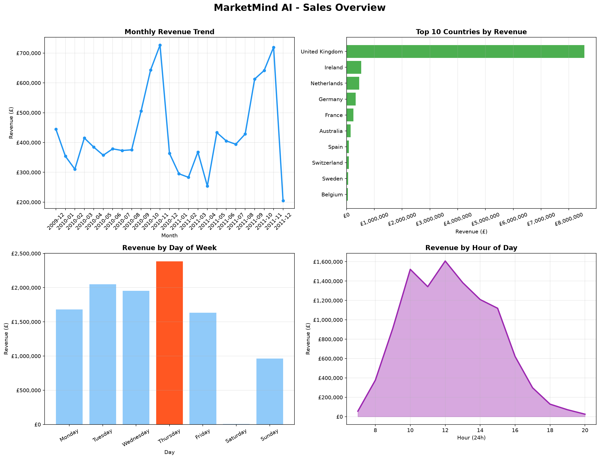
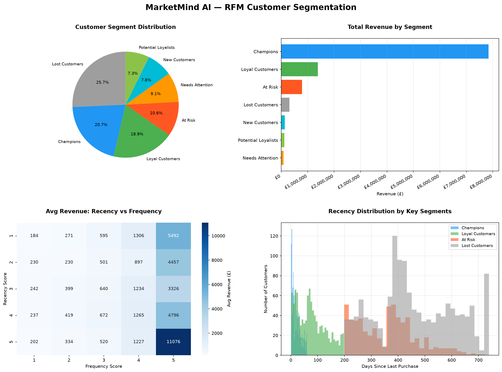
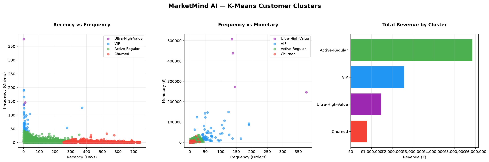
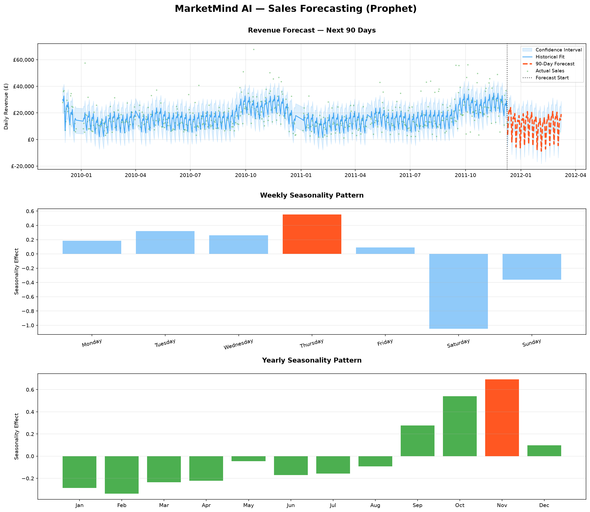
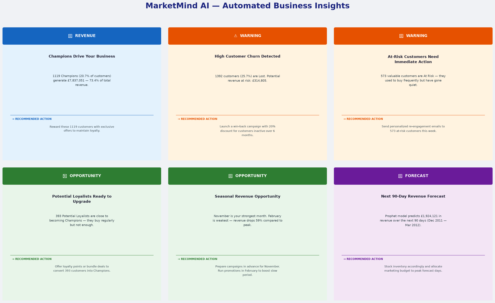

# 🧠 MarketMind AI
### AI-Powered E-commerce Analytics Suite


> A machine learning-powered analytics tool that transforms raw e-commerce transaction data into actionable business insights — no coding required.

---

## 📌 Project Overview

MarketMind AI is a Final Year Project built to demonstrate real-world data analytics capabilities for e-commerce businesses. Business owners and marketing managers can upload their sales CSV file and instantly receive AI-generated customer segments, sales forecasts, and strategic recommendations.

**Dataset:** [Online Retail II UCI](https://www.kaggle.com/datasets/mashlyn/online-retail-ii-uci)
**Records Analyzed:** 805,549 transactions | 5,878 customers | 41 countries

---

## 🚀 Key Features

### 👥 Module 1 — RFM Customer Segmentation
- Segments customers into 7 behavioral groups using RFM methodology
- K-Means Clustering (AI) to discover hidden customer patterns
- Identifies Champions, Loyal, At-Risk, and Lost customers
- **Key Finding:** 22.1% Champions generate 68.4% of total revenue

### 📈 Module 2 — Sales Forecasting
- Facebook Prophet model for 90-day revenue prediction
- Weekly and yearly seasonality pattern detection
- Confidence interval visualization
- **Key Finding:** £1,924,121 predicted revenue (Dec 2011 — Mar 2012)

### 💡 Module 3 — Automated Business Insights
- Rule-based AI engine generates 6 actionable business insights
- Color-coded cards: Revenue, Warning, Opportunity, Forecast
- Each insight includes a specific recommended action
- **Key Finding:** 1,523 lost customers represent £667,122 at-risk revenue

---

## 📊 Results & Business Insights

| Metric | Value |
|--------|-------|
| Total Revenue Analyzed | £17,743,429 |
| Total Customers | 5,878 |
| Champions (top segment) | 1,300 (22.1%) |
| Champions Revenue Share | 68.4% |
| Lost Customers | 1,523 (25.9%) |
| 90-Day Revenue Forecast | £1,924,121 |
| Best Sales Day | Thursday |
| Peak Revenue Month | November |

---

## 🛠️ Tech Stack

| Category | Technology |
|----------|------------|
| Language | Python 3.8+ |
| Frontend | Streamlit |
| Data Processing | Pandas, NumPy |
| Machine Learning | Scikit-learn (K-Means) |
| Forecasting | Facebook Prophet |
| Visualization | Matplotlib, Seaborn |
| Dataset | Kaggle — Online Retail II |

---

## 📁 Project Structure

```
MarketMind_AI/
│
├── app.py                          # Main Streamlit application
├── README.md                       # Project documentation
│
├── data/
│   └── online_retail_II.csv        # E-commerce dataset (Kaggle)
│
├── notebooks/
│   ├── 01_Data_Loading_EDA.ipynb   # Exploratory Data Analysis
│   ├── 02_RFM_Analysis.ipynb       # RFM + K-Means Clustering
│   ├── 03_Sales_Forecasting.ipynb  # Prophet Forecasting
│   └── 04_Automated_Insights.ipynb # Insight Generation Engine
│
└── outputs/
    ├── sales_overview.png          # EDA charts
    ├── rfm_analysis.png            # RFM segmentation charts
    ├── kmeans_clusters.png         # K-Means cluster visualization
    ├── sales_forecast.png          # Prophet forecast chart
    └── automated_insights_v2.png   # AI insight dashboard
```

---

## ⚙️ Installation & Setup

### Prerequisites
- Python 3.8+
- pip

### Step 1 — Clone the repository
```bash
git clone https://github.com/sanjoybarmon/MarketMindAI.git
cd MarketMindAI
```

### Step 2 — Install dependencies
```bash
pip install pandas numpy matplotlib seaborn scikit-learn prophet streamlit openpyxl
```

### Step 3 — Add dataset
Download [Online Retail II](https://www.kaggle.com/datasets/mashlyn/online-retail-ii-uci) from Kaggle and place `online_retail_II.csv` inside the `data/` folder.

### Step 4 — Run the application
```bash
streamlit run app.py
```

### Step 5 — Open in browser
```
http://localhost:8501
```

---

## 🎯 How to Use

1. **Launch** the app with `streamlit run app.py`
2. **Upload** your e-commerce CSV file from the sidebar
3. **Select** an analysis module from the navigation menu
4. **View** charts, metrics, and AI-generated insights
5. **Act** on the recommended business strategies

---

## 📸 Screenshots

### Sales Overview


### RFM Customer Segmentation


### K-Means Clusters


### Sales Forecast


### AI Insights Dashboard


---

## 🔮 Future Scope

- [ ] SQL database integration (PostgreSQL)
- [ ] Power BI / Tableau export functionality
- [ ] Real-time data pipeline (Apache Kafka)
- [ ] A/B Testing module
- [ ] Multi-language support
- [ ] Streamlit Cloud deployment

---

## 👨‍💻 Author

**Sanjoy Barmon**
BSc in Computer Science & Engineering
Uttara University, Dhaka, Bangladesh
📧 [Website](https://sanjoybarmon.com/)
🔗 [LinkedIn](https://linkedin.com/in/sanjoybarmon)
🐙 [GitHub](https://github.com/sanjoybarmon)

---

## 🏫 Academic Information

| Field | Details |
|-------|---------|
| Institution | Uttara University |
| Department | Computer Science & Engineering |
| Project Type | Final Year Project |
| Supervisor | Prof. Dr. Md. Obaidur Rahman |

---

## 📄 License

This project is licensed under the MIT License.
Feel free to use, modify, and distribute with attribution.

---

<div align="center">
  <strong>⭐ If you found this project helpful, please give it a star!</strong>
  <br><br>
  Built with ❤️ by Sanjoy Barmon | Uttara University
</div>
